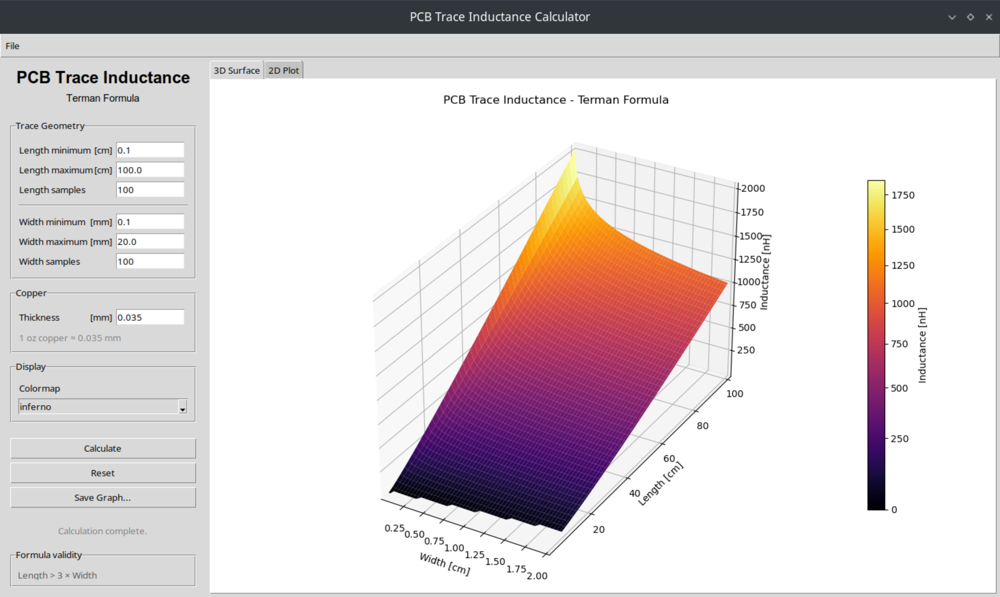
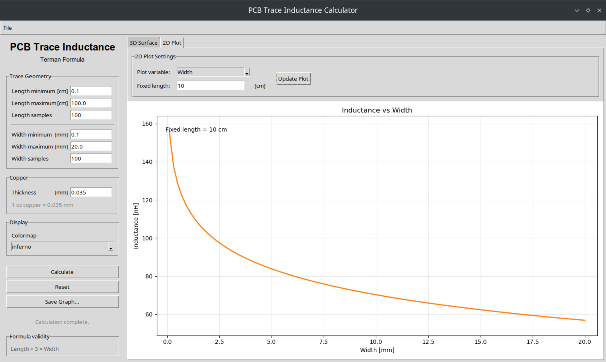

# Trace_Inductance_Calculator

Calculate the theoretical trace inductance of a straight PCB trace after the Terman Formula and model it in 3D and 2D praphs.
Use the 3D surface to quickly get an overview and then scope in with the 2D graph.

The calculated Inductances are only estimations and are to be treated as such.
Furthermore - for HF/RF applications - parasitics, such as capacitance, can significantly alter the behavior of the Trace.

&nbsp;

